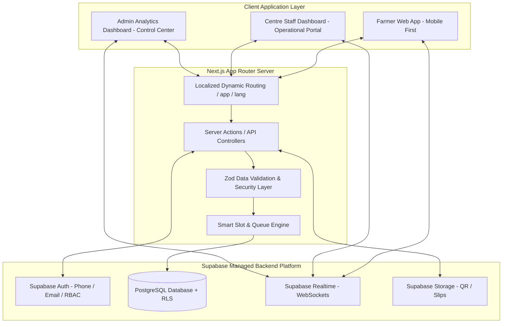

# Architecture Blueprint: KisanSetu

> **Technical Stack:** Next.js (App Router), React 19, TypeScript, Tailwind CSS, shadcn/ui, Supabase (PostgreSQL, Auth, Realtime, Storage).

---

## 1. System Architecture Overview

KisanSetu uses a modern, monolithic-decoupled architecture powered by **Next.js App Router** for full-stack web application delivery and **Supabase** as the Backend-as-a-Service (BaaS) providing managed PostgreSQL, authentication, row-level security, and real-time WebSocket broadcasting.



---

## 2. Technical Stack Specifications

- **Framework:** Next.js 15+ (App Router with Server Components & Server Actions)
- **Language:** TypeScript 5.x (Strict mode enabled)
- **Styling & UI:** Tailwind CSS v3 / v4, shadcn/ui (Radix UI primitives), Lucide Icons, Framer Motion (micro-animations)
- **State & Data Fetching:** React Server Components (RSC) for initial page render, `@tanstack/react-query` or Supabase Client Hooks for client-side state & mutation management
- **Database & Auth:** Supabase PostgreSQL with custom SQL schemas, indexes, and Row Level Security (RLS) policies
- **Realtime Services:** Supabase Realtime (Postgres Changes subscription engine for instant queue notifications)
- **Internationalization (i18n):** Light i18n dictionary system with locale-aware dictionary loading (`/lib/i18n`), client Context provider, and dynamic language persistence.

---

## 3. Project Directory Structure

```text
KisanSetu/
├── docs/                        # Architecture & Planning Documentation
│   ├── PRODUCT.md
│   ├── ARCHITECTURE.md
│   ├── DATABASE.md
│   ├── USER-FLOWS.md
│   ├── I18N.md
│   ├── SECURITY.md
│   └── DEMO.md
├── AGENTS.md                    # Project-level agent context & engineering rules
├── public/                      # Static assets, fallback translation keys, icons
│   └── locales/                 # i18n translation dictionary files (en, hi, pa, te, etc.)
│       ├── en.json
│       ├── hi.json
│       ├── pa.json
│       └── ...
├── src/
│   ├── app/                     # Next.js App Router structure
│   │   ├── (auth)/              # Authentication routes (login, register, verify)
│   │   │   ├── login/
│   │   │   └── register/
│   │   ├── (farmer)/            # Farmer Portal Layout & Pages (Mobile-First)
│   │   │   ├── dashboard/
│   │   │   ├── declarations/
│   │   │   │   ├── new/
│   │   │   │   └── page.tsx
│   │   │   ├── centres/
│   │   │   ├── book-slot/
│   │   │   ├── queue/[tokenId]/
│   │   │   └── payments/
│   │   ├── (staff)/             # Centre Staff Operational Portal
│   │   │   └── staff/
│   │   │       ├── check-in/
│   │   │       ├── queue-board/
│   │   │       └── grading/
│   │   ├── (admin)/             # Admin Dashboard
│   │   │   └── admin/
│   │   │       ├── analytics/
│   │   │       ├── centres/
│   │   │       ├── crops/
│   │   │       └── users/
│   │   ├── api/                 # Webhooks / Public API Endpoints
│   │   ├── layout.tsx
│   │   └── page.tsx             # Multilingual Landing Page
│   ├── components/              # React Components
│   │   ├── ui/                  # shadcn/ui components (button, card, dialog, etc.)
│   │   ├── farmer/              # Farmer specific components (TokenCard, CentreCard, QueueTracker)
│   │   ├── staff/               # Staff specific components (QRScanner, QualityForm, QueueTable)
│   │   ├── admin/               # Admin specific components (CongestionMap, CapacityChart)
│   │   ├── shared/              # Shared components (Header, LanguageSelector, StatusBadge)
│   │   └── providers/           # LanguageProvider, AuthProvider, RealtimeProvider
│   ├── hooks/                   # Custom Hooks (useQueueRealtime, useLanguage, useUserRole)
│   ├── lib/                     # Utilities & Service Clients
│   │   ├── supabase/            # Client, Server, and Middleware Supabase helpers
│   │   │   ├── client.ts
│   │   │   ├── server.ts
│   │   │   └── middleware.ts
│   │   ├── i18n/                # Translation loader & helper functions
│   │   │   ├── config.ts
│   │   │   └── dictionaries.ts
│   │   ├── utils.ts             # CN utility, date formatters, currency formatters
│   │   └── validators/          # Zod schema definitions
│   ├── services/                # Business Logic Services
│   │   ├── slotEngine.ts        # Smart slot booking & capacity calculation
│   │   ├── queueEngine.ts       # Queue calculation & ETA updates
│   │   └── paymentEngine.ts     # MSP Payout & payment status update pipeline
│   └── types/                   # TypeScript interfaces & Supabase generated types
│       ├── database.ts
│       └── index.ts
├── supabase/                    # Database Migrations & Seed Scripts
│   ├── migrations/              # SQL schema scripts
│   └── seed.sql                 # SIH Demo mock data (centres, crops, active slots)
├── package.json
├── tailwind.config.js
├── tsconfig.json
└── next.config.js
```

---

## 4. Key Application Engines & Algorithms

### 4.1 Smart Slot Scheduling Algorithm
To prevent centre congestion, slot availability is dynamically calculated based on:
$$C_{\text{hourly}} = \lfloor \frac{H_{\text{capacity}} \times O_{\text{factor}}}{T_{\text{avg}}} \rfloor$$
Where:
- $H_{\text{capacity}}$: Max physical weighbridge slots per hour at the centre.
- $O_{\text{factor}}$: Operational buffer factor (typically $0.85$ to prevent spillover).
- $T_{\text{avg}}$: Average processing time per tractor (estimated at 15-20 minutes).

When a farmer requests a slot, `slotEngine.ts` checks currently booked count vs $C_{\text{hourly}}$ before issuing a unique QR token code.

### 4.2 Real-Time Queue & Waiting Time (ETA) Engine
When Centre Staff completes a weighing/grading step or calls the next token, Supabase Realtime broadcasts the updated queue state to all connected farmer clients:
$$\text{ETA}_{\text{farmer}} = (\text{Position in Queue} - 1) \times \text{Average Processing Duration per Vehicle}$$

`useQueueRealtime` hook listens on table channel `queue_entries` filtered by `centre_id` and `booking_date`.

### 4.3 Centre Congestion Index Calculation
Centres are assigned a live Congestion Score ($0.0$ to $1.0$):
$$\text{Score} = w_1 \cdot \left(\frac{N_{\text{waiting}}}{C_{\text{max}}}\right) + w_2 \cdot \left(\frac{\text{Wait Time}}{60\text{ mins}}\right)$$
- **Score $< 0.5$:** Green (Low Congestion - Recommended)
- **$0.5 \le \text{Score} < 0.8$:** Yellow (Moderate Congestion)
- **Score $\ge 0.8$:** Red (High Congestion - Auto-throttling active)

---

## 5. Architectural Security & Scalability Controls

1. **Authentication:** Supabase Auth with Role-based Custom Claims (`role: 'FARMER' | 'CENTRE_STAFF' | 'ADMIN'`).
2. **Database Isolation:** Row Level Security (RLS) policies enforce that farmers can only view their own bookings, declarations, and payments. Staff can access records matching their assigned `centre_id`. Admin has system-wide read/write permissions.
3. **Decoupled i18n Layer:** UI texts read from standard locale keys (`t('booking.select_slot')`). Adding a new language requires appending a single JSON file without altering TS/React logic.
