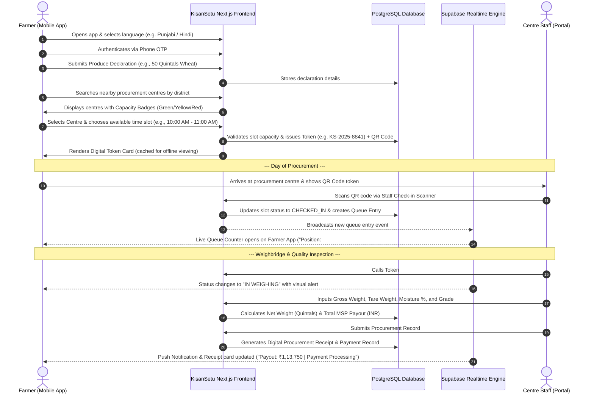

# User Flows & Operational Journeys: KisanSetu

> Detailed end-to-end user journeys for the three core roles: **FARMER**, **CENTRE_STAFF**, and **ADMIN**.

---

## 1. Journey 1: Farmer End-to-End Procurement Flow

---

## 2. Journey 2: Centre Staff Operational Flow

### Step 1: Gate Check-in & QR Scanning
1. Staff member opens `/staff/check-in` on tablet or smartphone.
2. Directs camera at farmer's mobile screen or printed token slip.
3. System verifies token validity, booking time window, and matching crop declaration.
4. One-tap **"Confirm Gate Arrival"** creates an active queue entry (`WAITING` status) and prints/displays queue sequence number.

### Step 2: Queue Management Board
1. Staff views `/staff/queue-board` displaying current queue stages: `WAITING`, `WEIGHING`, `GRADING`, `COMPLETED`.
2. Taps **"Call Next Vehicle"** when weighbridge clears.
3. Audio chime / visual announcement plays; farmer app receives live notification.

### Step 3: Weighing & Quality Entry
1. Staff accesses `/staff/grading?queue_id=XYZ`.
2. Enters:
   - Gross Vehicle Weight ($\text{kg}$)
   - Tare (Empty) Vehicle Weight ($\text{kg}$)
   - Automated Net Weight calculation in Quintals ($1\text{ Quintal} = 100\text{ kg}$)
   - Moisture Meter Reading ($\%$)
   - Quality Grade selection (`Grade A`, `FAQ`, or `Rejected`)
3. System auto-applies active MSP rate (e.g., ₹2,275 per quintal for Wheat).
4. Staff taps **"Submit & Issue Digital Slip"**.

---

## 3. Journey 3: Administrator Analytics & Operational Controls

### Step 1: District Capacity & Congestion Overview
1. Admin logs into `/admin/analytics`.
2. Interactive Map displays procurement centres in the district with live metrics:
   - Today's Target vs Procured Quantity (Quintals)
   - Active Wait Time Average per Centre
   - Congestion Index (Green = Safe, Red = Congested)

### Step 2: Smart Capacity Balancing
1. If Mandi *A* shows high congestion ($> 85\%$ capacity) while Mandi *B* is underutilized ($< 30\%$), Admin opens `/admin/centres`.
2. Admin adjusts hourly slot capacity for Mandi *A* or broadcasts a localized notification suggesting nearby alternate centres with bonus slot priority.

### Step 3: MSP Master & Crop Management
1. Admin updates crop baseline rates or maximum moisture limits before season start at `/admin/crops`.
2. Rate changes dynamically reflect in all future procurement record calculations across all centres instantly.

---

## 4. Key UI & UX Flow Principles

- **Zero Clutter on Mobile:** Farmer views feature large cards, high font contrast, and status indicators color-coded by industry standard (Green for Completed/Verified, Amber for In Progress, Red for Urgent).
- **One-Tap Actions:** Staff UI avoids complex navigation dropdowns during high-volume intake hours; key actions are prominent primary buttons.
- **Offline Token Cache:** Critical booking information (Token code, centre address, assigned slot, QR code string) is stored in client browser `localStorage` so farmers can present it at gates even with zero cellular signal.
